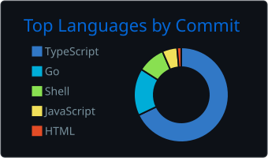
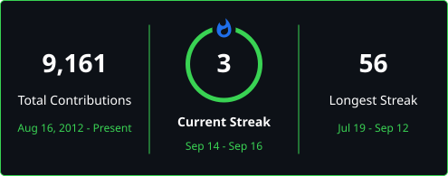
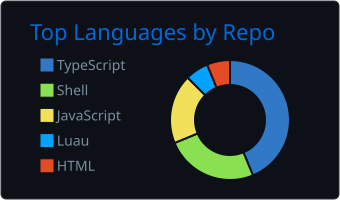
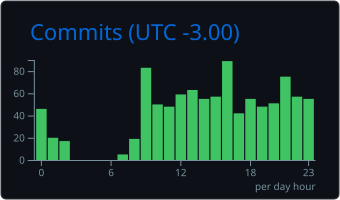

<h1 align="center">Hi, I'm Esteban Orrego 👋</h1>
<h3 align="center">Full Stack Developer · Shipping multi-tenant SaaS, AI in the loop</h3>

<em>Desarrollador Full Stack · Construyo SaaS multi-tenant con IA en el proceso</em>

<!-- Las imágenes van en celdas de tabla a propósito: GitHub renderiza las 
     del README con display:block, así que fuera de una tabla se apilan en columna. -->
<table align="center"><tr>
<td></td>
<td></td>
<td></td>
<td></td>
<td></td>
</tr></table>

---

### 🚀 About me

I'm a Full Stack Developer from Argentina 🇦🇷. I build **multi-tenant SaaS products end to end** — from data model to deployed UI — and I work hand in hand with **AI tooling and agentic workflows** to ship faster and with higher quality. I care about clean architecture, type safety, and developer experience.

> _Soy Full Stack Developer de Argentina. Construyo **productos SaaS multi-tenant de punta a punta** — del modelo de datos a la UI en producción — apoyándome en **herramientas de IA y flujos agénticos** para entregar más rápido y con mejor calidad. Me importan la arquitectura limpia, el type safety y la experiencia de desarrollo._

### 🛠️ What I'm working on

- 🏗️ **Multi-tenant SaaS** — architecture, auth, and data modeling for real products _(SaaS multi-tenant: arquitectura, auth y modelado de datos para productos reales)_
- 🤖 **AI-assisted engineering** — LLM integrations, agent workflows, and AI-augmented development _(Ingeniería asistida por IA: integraciones LLM, flujos con agentes y desarrollo aumentado con IA)_
- ⚙️ **End-to-end delivery** — TypeScript/React frontends backed by Node & Go services _(Entrega end-to-end: frontends TypeScript/React sobre servicios Node y Go)_

### 🧰 Tech stack

<table><tr>
<td></td>
<td></td>
<td></td>
<td></td>
<td></td>
</tr><tr>
<td></td>
<td></td>
<td></td>
<td></td>
<td></td>
</tr></table>

### 📊 Activity

<table align="center"><tr>
<td></td>
<td></td>
</tr></table>

> _Most of my work lives in private repositories. These cards are generated from my own account data, so they reflect the real volume — not just what's public._
> _La mayor parte de mi trabajo está en repositorios privados. Estas tarjetas se generan con los datos de mi propia cuenta, así que reflejan el volumen real — no solo lo público._

📈 More stats · Más métricas

 
<table align="center"><tr>
<td></td>
<td></td>
</tr></table>

---

<em>💬 Open to interesting full-stack & AI projects — feel free to reach out!</em> <em>Abierto a proyectos full-stack y de IA — ¡escribime!</em>

